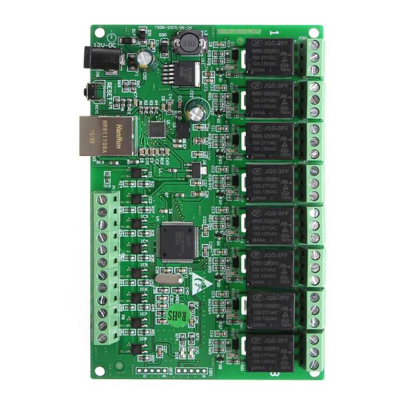
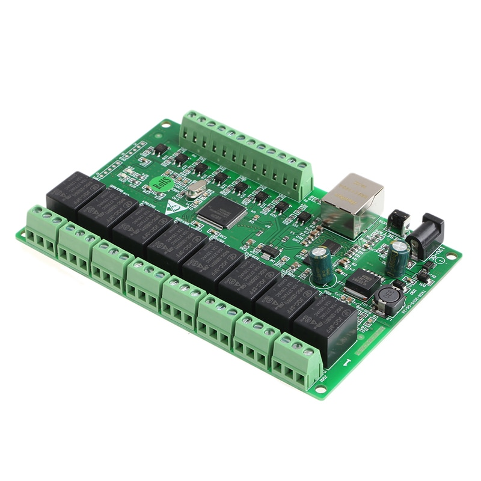
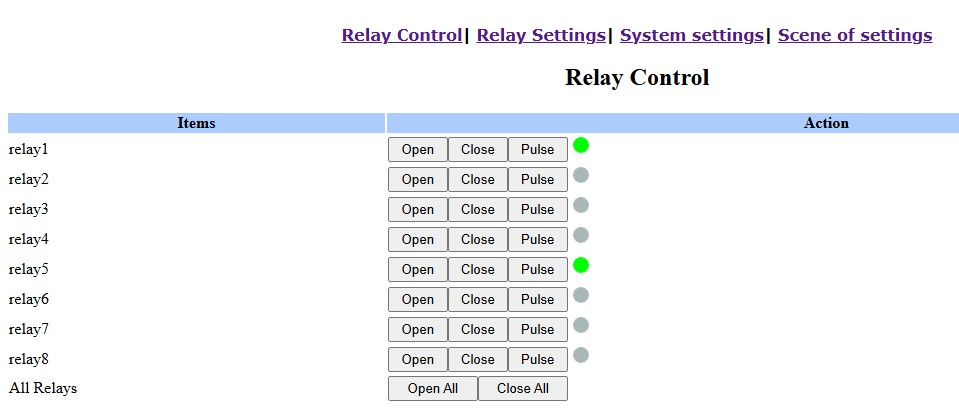

# ha-zm-web
Simple HA integration of 8 relay "ZM_WEB" bought on AliExpress

I have a pretty old version of this card that support only HTTP and TCP.
In HA we cannot aggregate a command_line result in multiple sensors, so HTTP is the easiest way to get a responsive (1s) card without too much network requests.

Here you have the exemple of my configuration, you just need to replace IP, USER and PASSWORD with the values of your card.

Enjoy!

